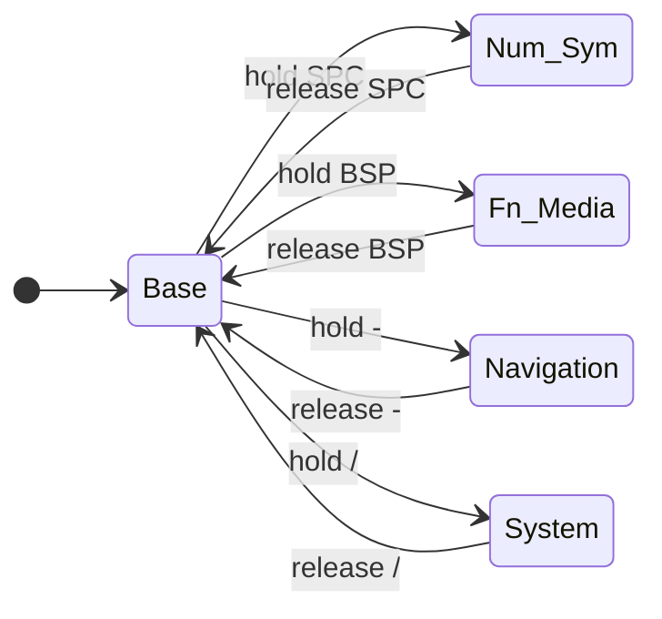
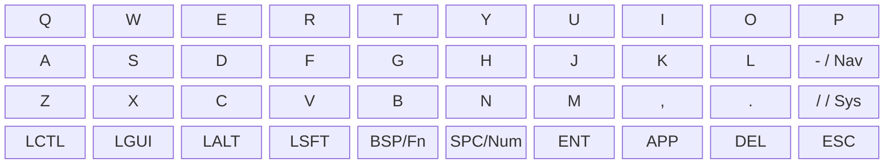
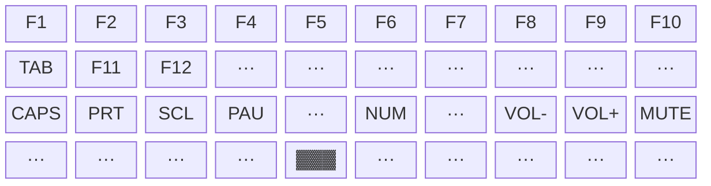
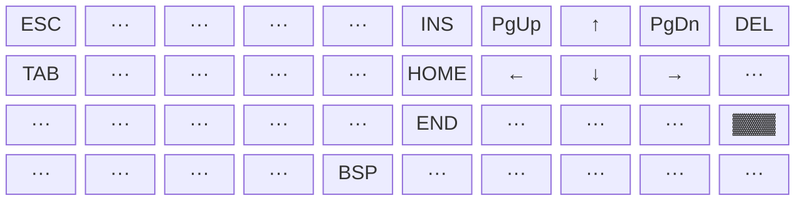
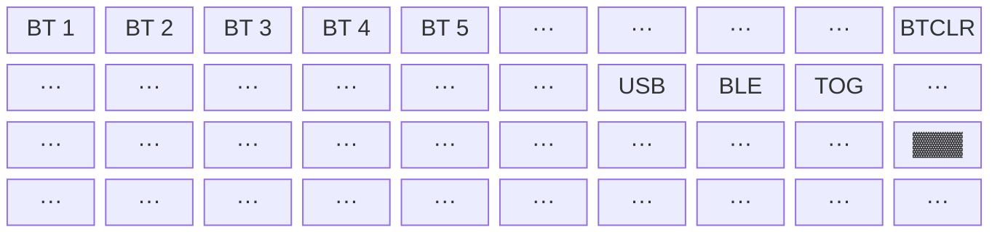

# banime40 — Keymap Diagrams (Mermaid)

Reference for user guide. All 5 layers.

---

## Layer Switching Overview



---

## Layer 0 — Base (QWERTY)



---

## Layer 1 — Num / Sym (hold SPC)

```mermaid
block-beta
  columns 10
  n1["1"]    n2["2"]    n3["3"]    n4["4"]    n5["5"]    n6["6"]    n7["7"]    n8["8"]    n9["9"]    n0["0"]
  tb["TAB"]  _a["···"]  _b["···"]  gv["` "]   lb["["]    rb["]"]    bs["\\"]   sc[";"]    sq["'"]    mn["-"]
  _c["···"]  _d["···"]  _e["···"]  _f["···"]  eq["="]    mn2["-"]   _g["···"]  _h["···"]  _i["···"]  _j["···"]
  _k["···"]  _l["···"]  _m["···"]  _n["···"]  _o["···"]  ac1["▓▓▓"] _p["···"]  _q["···"]  _r["···"]  _s["···"]
```

---

## Layer 2 — Fn / Media (hold BSP)



---

## Layer 3 — Navigation (hold -)



---

## Layer 4 — System / Bluetooth (hold /)



---

## Legend

| Symbol | Meaning |
|---|---|
| `▓▓▓` | Key đang giữ để kích hoạt layer này |
| `···` | Không có phím (transparent / none) |
| `X / Y` | Tap = X, Hold = Y |
| `BT 1–5` | Chọn Bluetooth profile 1–5 |
| `BTCLR` | Xóa bond Bluetooth profile hiện tại |
| `USB` | Ép output sang USB HID |
| `BLE` | Ép output sang BLE |
| `TOG` | Toggle USB ↔ BLE |
